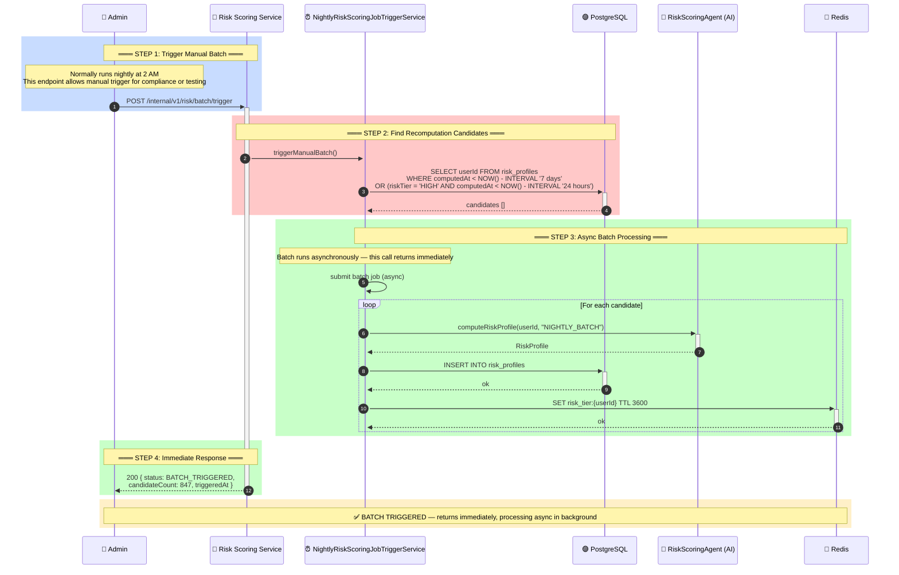

```mermaid
sequenceDiagram
    autonumber
    participant ADMIN as 👮 Admin
    participant RS as 🔴 Risk Scoring Service
    participant BS as ⏰ NightlyRiskScoringJobTriggerService
    participant PG as 🟣 PostgreSQL
    participant AG as 🤖 RiskScoringAgent (AI)
    participant RD as 🔴 Redis

    rect rgb(200, 220, 255)
        Note over ADMIN,RS: ═══ STEP 1: Trigger Manual Batch ═══
        Note over ADMIN: Normally runs nightly at 2 AM<br/>This endpoint allows manual trigger for compliance or testing
        ADMIN->>+RS: POST /internal/v1/risk/batch/trigger
    end

    rect rgb(255, 200, 200)
        Note over RS,PG: ═══ STEP 2: Find Recomputation Candidates ═══
        RS->>+BS: triggerManualBatch()
        BS->>+PG: SELECT userId FROM risk_profiles<br/>WHERE computedAt < NOW() - INTERVAL '7 days'<br/>OR (riskTier = 'HIGH' AND computedAt < NOW() - INTERVAL '24 hours')
        PG-->>-BS: candidates []
    end

    rect rgb(200, 255, 200)
        Note over BS,RD: ═══ STEP 3: Async Batch Processing ═══
        Note over BS: Batch runs asynchronously — this call returns immediately
        BS->>BS: submit batch job (async)
        loop For each candidate
            BS->>+AG: computeRiskProfile(userId, "NIGHTLY_BATCH")
            AG-->>-BS: RiskProfile
            BS->>+PG: INSERT INTO risk_profiles
            PG-->>-BS: ok
            BS->>+RD: SET risk_tier:{userId} TTL 3600
            RD-->>-BS: ok
        end
    end

    rect rgb(200, 255, 200)
        Note over RS,ADMIN: ═══ STEP 4: Immediate Response ═══
        RS-->>-ADMIN: 200 { status: BATCH_TRIGGERED,<br/>  candidateCount: 847, triggeredAt }
    end

    rect rgb(255, 240, 200)
        Note over ADMIN,RD: ✅ BATCH TRIGGERED — returns immediately, processing async in background
    end
```
