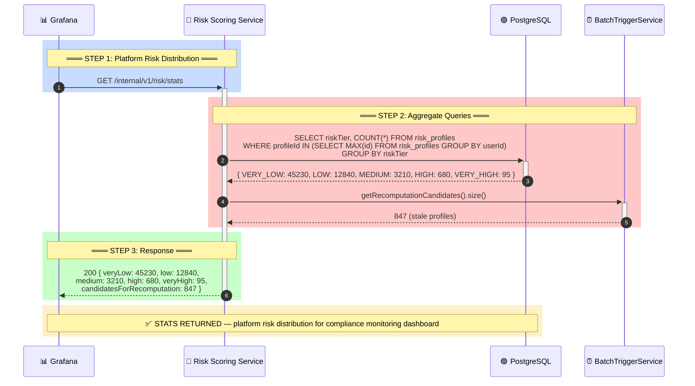

```mermaid
sequenceDiagram
    autonumber
    participant GRF as 📊 Grafana
    participant RS as 🔴 Risk Scoring Service
    participant PG as 🟣 PostgreSQL
    participant BS as ⏰ BatchTriggerService

    rect rgb(200, 220, 255)
        Note over GRF,RS: ═══ STEP 1: Platform Risk Distribution ═══
        GRF->>+RS: GET /internal/v1/risk/stats
    end

    rect rgb(255, 200, 200)
        Note over RS,BS: ═══ STEP 2: Aggregate Queries ═══
        RS->>+PG: SELECT riskTier, COUNT(*) FROM risk_profiles<br/>WHERE profileId IN (SELECT MAX(id) FROM risk_profiles GROUP BY userId)<br/>GROUP BY riskTier
        PG-->>-RS: { VERY_LOW: 45230, LOW: 12840, MEDIUM: 3210, HIGH: 680, VERY_HIGH: 95 }
        RS->>+BS: getRecomputationCandidates().size()
        BS-->>-RS: 847 (stale profiles)
    end

    rect rgb(200, 255, 200)
        Note over RS,GRF: ═══ STEP 3: Response ═══
        RS-->>-GRF: 200 { veryLow: 45230, low: 12840,<br/>  medium: 3210, high: 680, veryHigh: 95,<br/>  candidatesForRecomputation: 847 }
    end

    rect rgb(255, 240, 200)
        Note over GRF,PG: ✅ STATS RETURNED — platform risk distribution for compliance monitoring dashboard
    end
```
