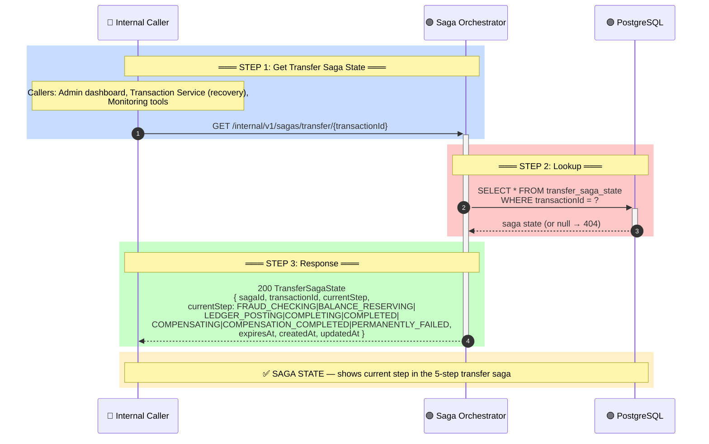

```mermaid
sequenceDiagram
    autonumber
    participant CALLER as 🔵 Internal Caller
    participant SO as 🟢 Saga Orchestrator
    participant PG as 🟣 PostgreSQL

    rect rgb(200, 220, 255)
        Note over CALLER,SO: ═══ STEP 1: Get Transfer Saga State ═══
        Note over CALLER: Callers: Admin dashboard, Transaction Service (recovery),<br/>Monitoring tools
        CALLER->>+SO: GET /internal/v1/sagas/transfer/{transactionId}
    end

    rect rgb(255, 200, 200)
        Note over SO,PG: ═══ STEP 2: Lookup ═══
        SO->>+PG: SELECT * FROM transfer_saga_state<br/>WHERE transactionId = ?
        PG-->>-SO: saga state (or null → 404)
    end

    rect rgb(200, 255, 200)
        Note over SO,CALLER: ═══ STEP 3: Response ═══
        SO-->>-CALLER: 200 TransferSagaState<br/>{ sagaId, transactionId, currentStep,<br/>  currentStep: FRAUD_CHECKING|BALANCE_RESERVING|<br/>               LEDGER_POSTING|COMPLETING|COMPLETED|<br/>               COMPENSATING|COMPENSATION_COMPLETED|PERMANENTLY_FAILED,<br/>  expiresAt, createdAt, updatedAt }
    end

    rect rgb(255, 240, 200)
        Note over CALLER,PG: ✅ SAGA STATE — shows current step in the 5-step transfer saga
    end
```
