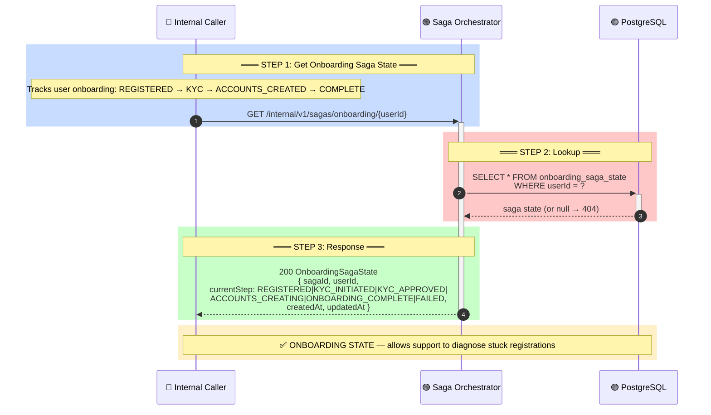

```mermaid
sequenceDiagram
    autonumber
    participant CALLER as 🔵 Internal Caller
    participant SO as 🟢 Saga Orchestrator
    participant PG as 🟣 PostgreSQL

    rect rgb(200, 220, 255)
        Note over CALLER,SO: ═══ STEP 1: Get Onboarding Saga State ═══
        Note over CALLER: Tracks user onboarding: REGISTERED → KYC → ACCOUNTS_CREATED → COMPLETE
        CALLER->>+SO: GET /internal/v1/sagas/onboarding/{userId}
    end

    rect rgb(255, 200, 200)
        Note over SO,PG: ═══ STEP 2: Lookup ═══
        SO->>+PG: SELECT * FROM onboarding_saga_state<br/>WHERE userId = ?
        PG-->>-SO: saga state (or null → 404)
    end

    rect rgb(200, 255, 200)
        Note over SO,CALLER: ═══ STEP 3: Response ═══
        SO-->>-CALLER: 200 OnboardingSagaState<br/>{ sagaId, userId,<br/>  currentStep: REGISTERED|KYC_INITIATED|KYC_APPROVED|<br/>               ACCOUNTS_CREATING|ONBOARDING_COMPLETE|FAILED,<br/>  createdAt, updatedAt }
    end

    rect rgb(255, 240, 200)
        Note over CALLER,PG: ✅ ONBOARDING STATE — allows support to diagnose stuck registrations
    end
```
