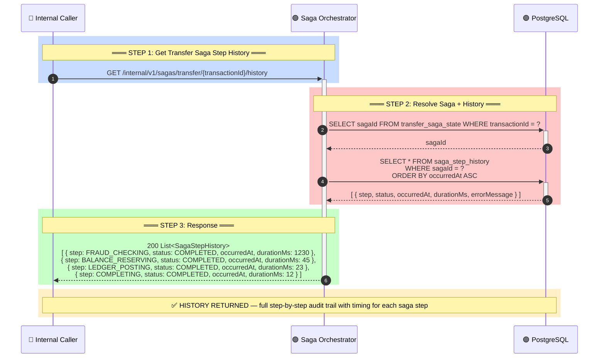

```mermaid
sequenceDiagram
    autonumber
    participant CALLER as 🔵 Internal Caller
    participant SO as 🟢 Saga Orchestrator
    participant PG as 🟣 PostgreSQL

    rect rgb(200, 220, 255)
        Note over CALLER,SO: ═══ STEP 1: Get Transfer Saga Step History ═══
        CALLER->>+SO: GET /internal/v1/sagas/transfer/{transactionId}/history
    end

    rect rgb(255, 200, 200)
        Note over SO,PG: ═══ STEP 2: Resolve Saga + History ═══
        SO->>+PG: SELECT sagaId FROM transfer_saga_state WHERE transactionId = ?
        PG-->>-SO: sagaId
        SO->>+PG: SELECT * FROM saga_step_history<br/>WHERE sagaId = ?<br/>ORDER BY occurredAt ASC
        PG-->>-SO: [ { step, status, occurredAt, durationMs, errorMessage } ]
    end

    rect rgb(200, 255, 200)
        Note over SO,CALLER: ═══ STEP 3: Response ═══
        SO-->>-CALLER: 200 List<SagaStepHistory><br/>[ { step: FRAUD_CHECKING, status: COMPLETED, occurredAt, durationMs: 1230 },<br/>  { step: BALANCE_RESERVING, status: COMPLETED, occurredAt, durationMs: 45 },<br/>  { step: LEDGER_POSTING, status: COMPLETED, occurredAt, durationMs: 23 },<br/>  { step: COMPLETING, status: COMPLETED, occurredAt, durationMs: 12 } ]
    end

    rect rgb(255, 240, 200)
        Note over CALLER,PG: ✅ HISTORY RETURNED — full step-by-step audit trail with timing for each saga step
    end
```
