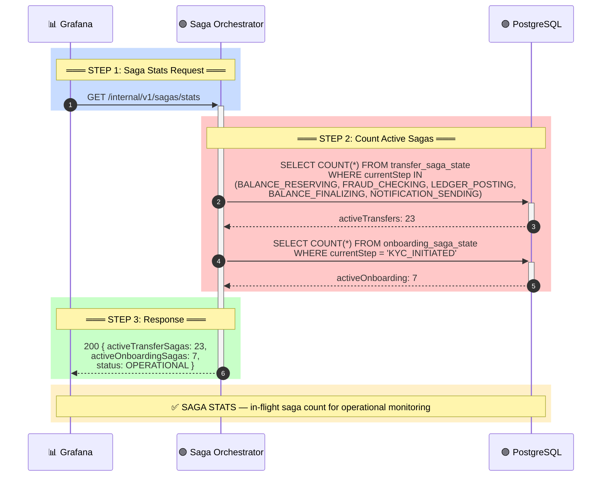

```mermaid
sequenceDiagram
    autonumber
    participant GRF as 📊 Grafana
    participant SO as 🟢 Saga Orchestrator
    participant PG as 🟣 PostgreSQL

    rect rgb(200, 220, 255)
        Note over GRF,SO: ═══ STEP 1: Saga Stats Request ═══
        GRF->>+SO: GET /internal/v1/sagas/stats
    end

    rect rgb(255, 200, 200)
        Note over SO,PG: ═══ STEP 2: Count Active Sagas ═══
        SO->>+PG: SELECT COUNT(*) FROM transfer_saga_state<br/>WHERE currentStep IN<br/>  (BALANCE_RESERVING, FRAUD_CHECKING, LEDGER_POSTING,<br/>   BALANCE_FINALIZING, NOTIFICATION_SENDING)
        PG-->>-SO: activeTransfers: 23
        SO->>+PG: SELECT COUNT(*) FROM onboarding_saga_state<br/>WHERE currentStep = 'KYC_INITIATED'
        PG-->>-SO: activeOnboarding: 7
    end

    rect rgb(200, 255, 200)
        Note over SO,GRF: ═══ STEP 3: Response ═══
        SO-->>-GRF: 200 { activeTransferSagas: 23,<br/>  activeOnboardingSagas: 7,<br/>  status: OPERATIONAL }
    end

    rect rgb(255, 240, 200)
        Note over GRF,PG: ✅ SAGA STATS — in-flight saga count for operational monitoring
    end
```
