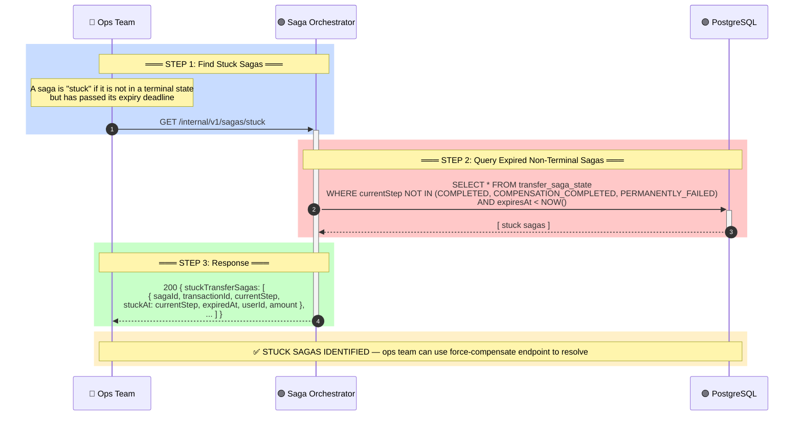

```mermaid
sequenceDiagram
    autonumber
    participant OPS as 🔧 Ops Team
    participant SO as 🟢 Saga Orchestrator
    participant PG as 🟣 PostgreSQL

    rect rgb(200, 220, 255)
        Note over OPS,SO: ═══ STEP 1: Find Stuck Sagas ═══
        Note over OPS: A saga is "stuck" if it is not in a terminal state<br/>but has passed its expiry deadline
        OPS->>+SO: GET /internal/v1/sagas/stuck
    end

    rect rgb(255, 200, 200)
        Note over SO,PG: ═══ STEP 2: Query Expired Non-Terminal Sagas ═══
        SO->>+PG: SELECT * FROM transfer_saga_state<br/>WHERE currentStep NOT IN (COMPLETED, COMPENSATION_COMPLETED, PERMANENTLY_FAILED)<br/>AND expiresAt < NOW()
        PG-->>-SO: [ stuck sagas ]
    end

    rect rgb(200, 255, 200)
        Note over SO,OPS: ═══ STEP 3: Response ═══
        SO-->>-OPS: 200 { stuckTransferSagas: [<br/>  { sagaId, transactionId, currentStep,<br/>    stuckAt: currentStep, expiredAt, userId, amount },<br/>  ... ] }
    end

    rect rgb(255, 240, 200)
        Note over OPS,PG: ✅ STUCK SAGAS IDENTIFIED — ops team can use force-compensate endpoint to resolve
    end
```
