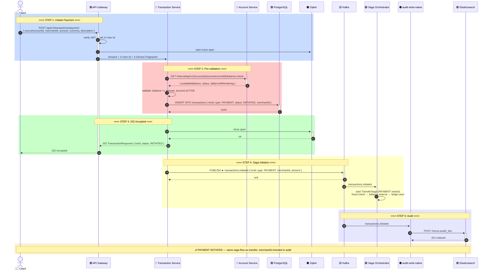

```mermaid
sequenceDiagram
    autonumber
    actor Client as 🧑‍💻 Client
    participant GW as 🟢 API Gateway
    participant TX as 🔵 Transaction Service
    participant AC as 🔵 Account Service
    participant PG as 🟣 PostgreSQL
    participant ZP as 🟠 Zipkin
    participant K as 🟡 Kafka
    participant SO as 🟢 Saga Orchestrator
    participant AUD as 🟠 audit-write-native
    participant ES as 🟣 Elasticsearch

    rect rgb(200, 220, 255)
        Note over Client,GW: ═══ STEP 1: Initiate Payment ═══
        Client->>+GW: POST /api/v1/transactions/payment<br/>{ sourceAccountId, merchantId, amount, currency, description }
        GW->>GW: verify JWT → set X-User-Id
        GW->>+ZP: open trace span
        GW->>+TX: forward + X-User-Id + X-Device-Fingerprint
    end

    rect rgb(255, 200, 200)
        Note over TX,AC: ═══ STEP 2: Pre-validation ═══
        TX->>+AC: GET /internal/api/v1/accounts/{sourceAccountId}/balance-check
        AC-->>-TX: { availableBalance, status, dailyLimitRemaining }
        TX->>TX: validate: balance >= amount, account ACTIVE
        TX->>+PG: INSERT INTO transactions { txnId, type: PAYMENT, status: INITIATED, merchantId }
        PG-->>-TX: txnId
    end

    rect rgb(200, 255, 200)
        Note over TX,GW: ═══ STEP 3: 202 Accepted ═══
        TX->>+ZP: close span
        ZP-->>-TX: ok
        TX-->>GW: 202 TransactionResponse { txnId, status: INITIATED }
        GW-->>-Client: 202 Accepted
    end

    rect rgb(255, 255, 200)
        Note over TX,K: ═══ STEP 4: Saga Initiation ═══
        TX->>+K: PUBLISH ► transactions.initiated { txnId, type: PAYMENT, merchantId, amount }
        K-->>-TX: ack
        K->>+SO: transactions.initiated
        SO->>SO: start TransferSaga (PAYMENT variant)<br/>fraud check → balance reserve → ledger post
    end

    rect rgb(230, 230, 255)
        Note over K,ES: ═══ STEP 5: Audit ═══
        K->>+AUD: transactions.initiated
        AUD->>+ES: POST /nexus-audit/_doc
        ES-->>-AUD: 201 indexed
    end

    rect rgb(255, 240, 200)
        Note over Client,ES: ✅ PAYMENT INITIATED — same saga flow as transfer, merchantId included in audit
    end
```
