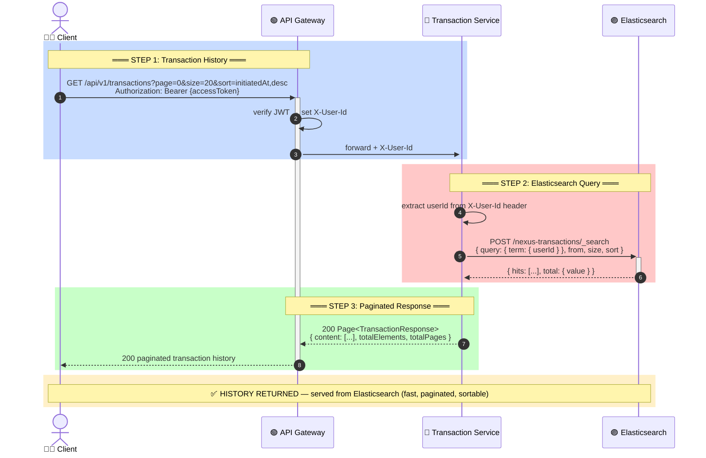

```mermaid
sequenceDiagram
    autonumber
    actor Client as 🧑‍💻 Client
    participant GW as 🟢 API Gateway
    participant TX as 🔵 Transaction Service
    participant ES as 🟣 Elasticsearch

    rect rgb(200, 220, 255)
        Note over Client,GW: ═══ STEP 1: Transaction History ═══
        Client->>+GW: GET /api/v1/transactions?page=0&size=20&sort=initiatedAt,desc<br/>Authorization: Bearer {accessToken}
        GW->>GW: verify JWT → set X-User-Id
        GW->>+TX: forward + X-User-Id
    end

    rect rgb(255, 200, 200)
        Note over TX,ES: ═══ STEP 2: Elasticsearch Query ═══
        TX->>TX: extract userId from X-User-Id header
        TX->>+ES: POST /nexus-transactions/_search<br/>{ query: { term: { userId } }, from, size, sort }
        ES-->>-TX: { hits: [...], total: { value } }
    end

    rect rgb(200, 255, 200)
        Note over TX,GW: ═══ STEP 3: Paginated Response ═══
        TX-->>GW: 200 Page<TransactionResponse><br/>{ content: [...], totalElements, totalPages }
        GW-->>-Client: 200 paginated transaction history
    end

    rect rgb(255, 240, 200)
        Note over Client,ES: ✅ HISTORY RETURNED — served from Elasticsearch (fast, paginated, sortable)
    end
```
