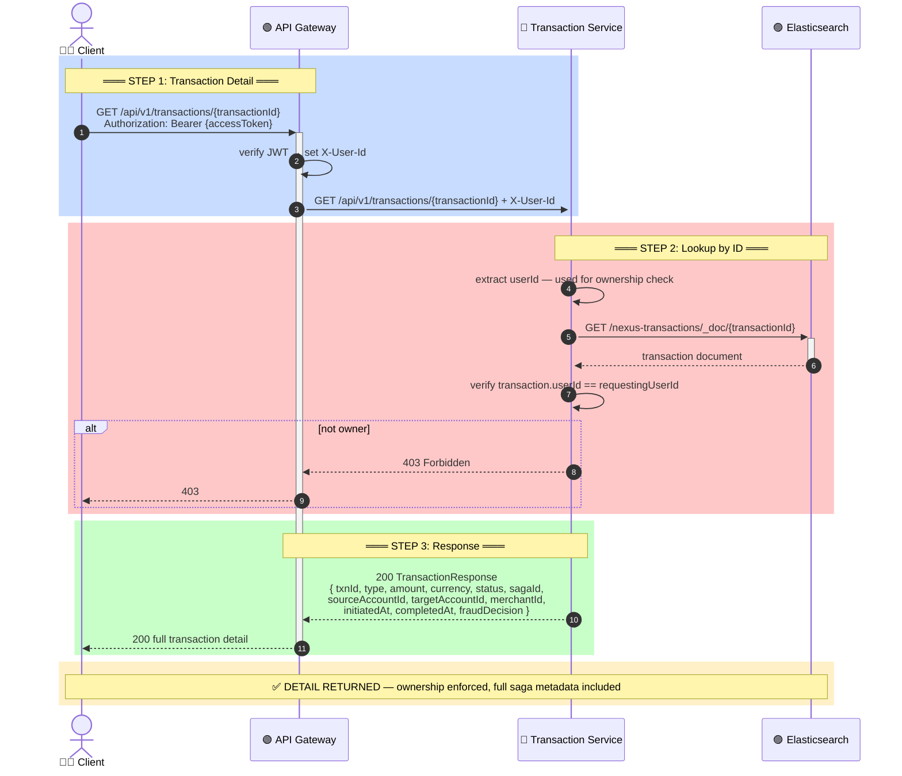

```mermaid
sequenceDiagram
    autonumber
    actor Client as 🧑‍💻 Client
    participant GW as 🟢 API Gateway
    participant TX as 🔵 Transaction Service
    participant ES as 🟣 Elasticsearch

    rect rgb(200, 220, 255)
        Note over Client,GW: ═══ STEP 1: Transaction Detail ═══
        Client->>+GW: GET /api/v1/transactions/{transactionId}<br/>Authorization: Bearer {accessToken}
        GW->>GW: verify JWT → set X-User-Id
        GW->>+TX: GET /api/v1/transactions/{transactionId} + X-User-Id
    end

    rect rgb(255, 200, 200)
        Note over TX,ES: ═══ STEP 2: Lookup by ID ═══
        TX->>TX: extract userId — used for ownership check
        TX->>+ES: GET /nexus-transactions/_doc/{transactionId}
        ES-->>-TX: transaction document
        TX->>TX: verify transaction.userId == requestingUserId
        alt not owner
            TX-->>GW: 403 Forbidden
            GW-->>Client: 403
        end
    end

    rect rgb(200, 255, 200)
        Note over TX,GW: ═══ STEP 3: Response ═══
        TX-->>GW: 200 TransactionResponse<br/>{ txnId, type, amount, currency, status, sagaId,<br/>  sourceAccountId, targetAccountId, merchantId,<br/>  initiatedAt, completedAt, fraudDecision }
        GW-->>-Client: 200 full transaction detail
    end

    rect rgb(255, 240, 200)
        Note over Client,ES: ✅ DETAIL RETURNED — ownership enforced, full saga metadata included
    end
```
