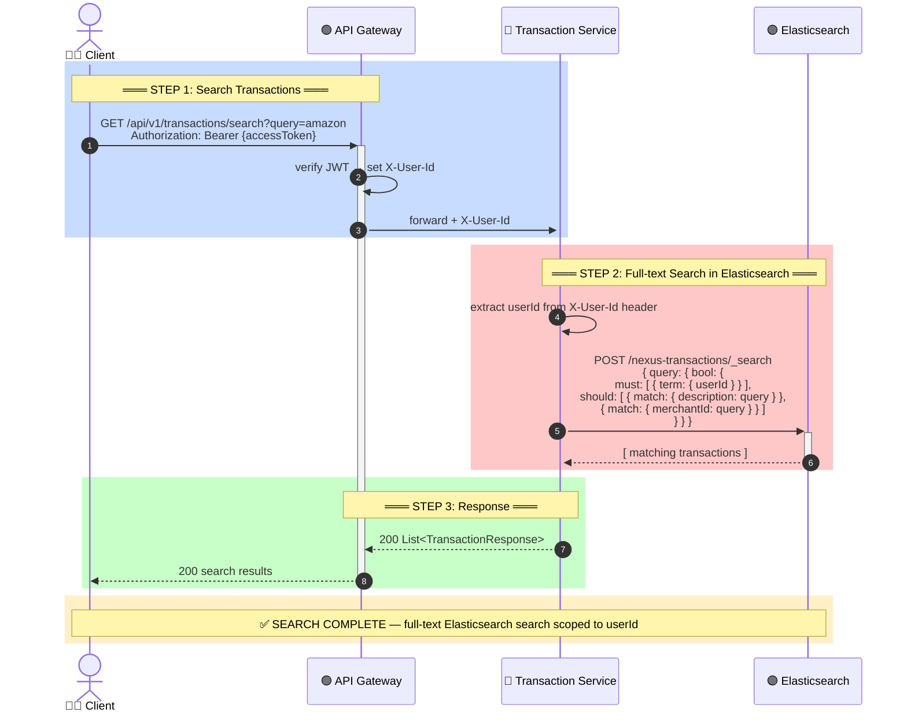

```mermaid
sequenceDiagram
    autonumber
    actor Client as 🧑‍💻 Client
    participant GW as 🟢 API Gateway
    participant TX as 🔵 Transaction Service
    participant ES as 🟣 Elasticsearch

    rect rgb(200, 220, 255)
        Note over Client,GW: ═══ STEP 1: Search Transactions ═══
        Client->>+GW: GET /api/v1/transactions/search?query=amazon<br/>Authorization: Bearer {accessToken}
        GW->>GW: verify JWT → set X-User-Id
        GW->>+TX: forward + X-User-Id
    end

    rect rgb(255, 200, 200)
        Note over TX,ES: ═══ STEP 2: Full-text Search in Elasticsearch ═══
        TX->>TX: extract userId from X-User-Id header
        TX->>+ES: POST /nexus-transactions/_search<br/>{ query: { bool: {<br/>    must: [ { term: { userId } } ],<br/>    should: [ { match: { description: query } },<br/>              { match: { merchantId: query } } ]<br/>  } } }
        ES-->>-TX: [ matching transactions ]
    end

    rect rgb(200, 255, 200)
        Note over TX,GW: ═══ STEP 3: Response ═══
        TX-->>GW: 200 List<TransactionResponse>
        GW-->>-Client: 200 search results
    end

    rect rgb(255, 240, 200)
        Note over Client,ES: ✅ SEARCH COMPLETE — full-text Elasticsearch search scoped to userId
    end
```
